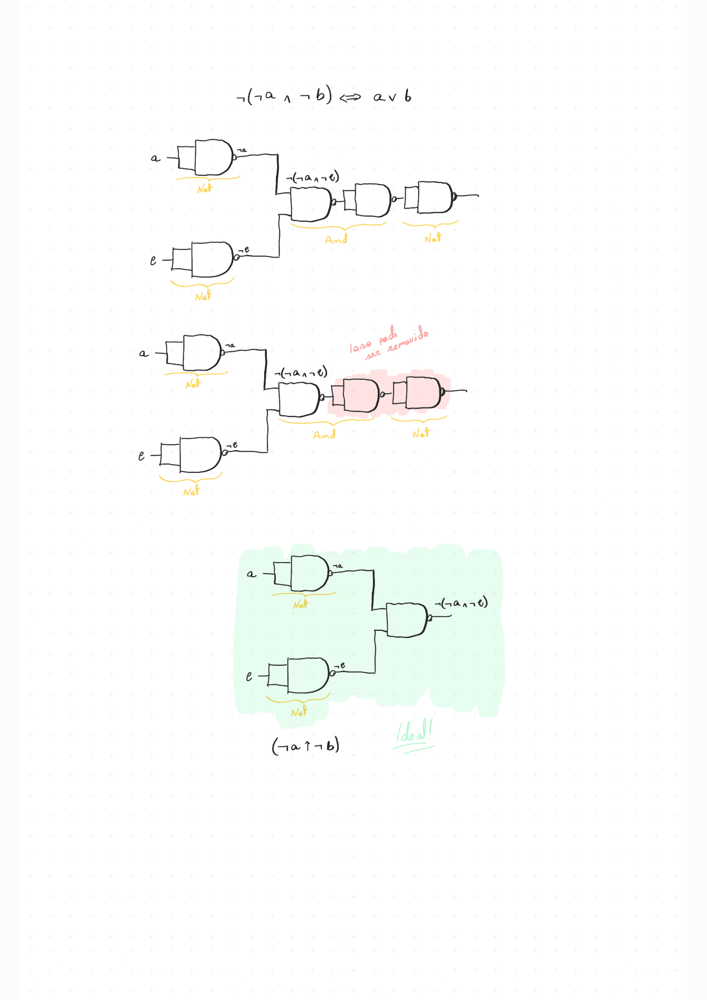
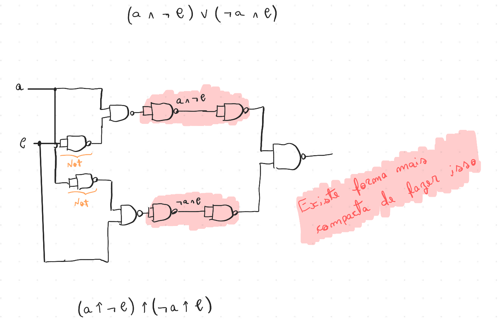

> **Notation: We will use this symbol (↑) to represent a NAND operator**

## NOT

Truthy table:

| a   | not(a) |
| --- | ------ |
| 0   | 1      |
| 1   | 0      |

To create a NOT gate with NANDs, we can use input the same a input twice:

| a   | nand(a, a) |
| --- | ---------- |
| 0   | 1          |
| 1   | 0          |

## AND

Truthy table:

| a   | b   | and(a, b) |
| --- | --- | --------- |
| 0   | 0   | 0         |
| 0   | 1   | 0         |
| 1   | 0   | 0         |
| 1   | 1   | 1         |

To create a AND gate with NANDs, we can use the negation of negation:

¬¬(a ∧ b) = ¬(a ↑ b) = a ∧ b

## OR

Truthy table:

| a   | b   | or(a, b) |
| --- | --- | -------- |
| 0   | 0   | 0        |
| 0   | 1   | 1        |
| 1   | 0   | 1        |
| 1   | 1   | 1        |

To create a OR gate with NANDs, we can use the DeMorgan's law:

¬(¬a ∧ ¬b) = a ∨ b = ¬a ↑ ¬b

## XOR

Truthy table:

| a   | b   | xor(a, b) |
| --- | --- | --------- |
| 0   | 0   | 0         |
| 0   | 1   | 1         |
| 1   | 0   | 1         |
| 1   | 1   | 0         |

We can make a XOR gate with NANDs like this:

(a ↑ ¬b) ↑ (¬a ↑ b)

but it's not the best way to do it.